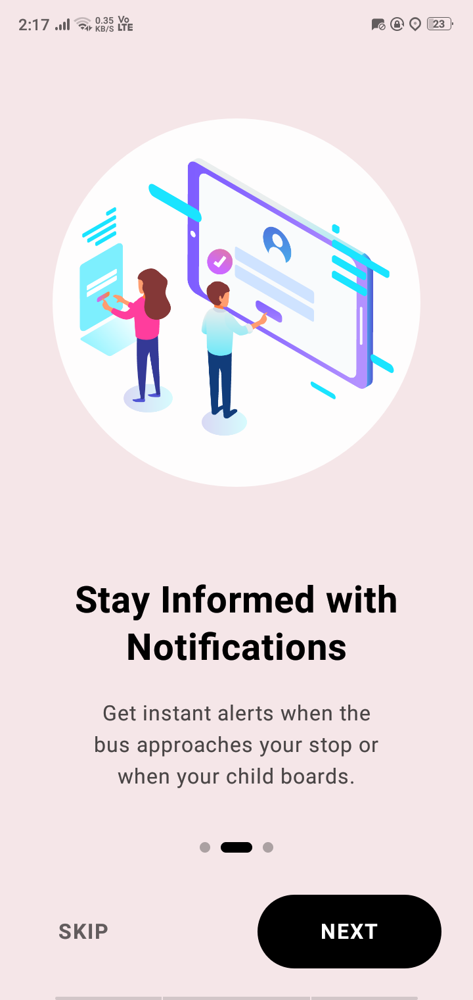
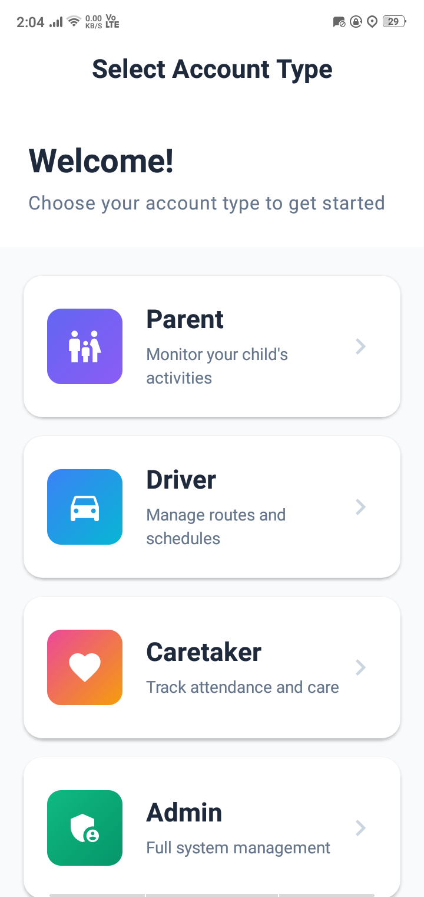
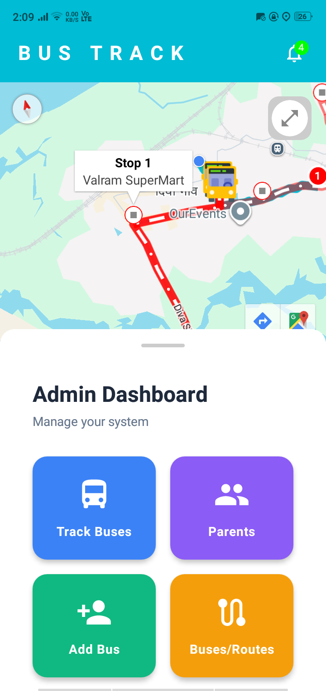
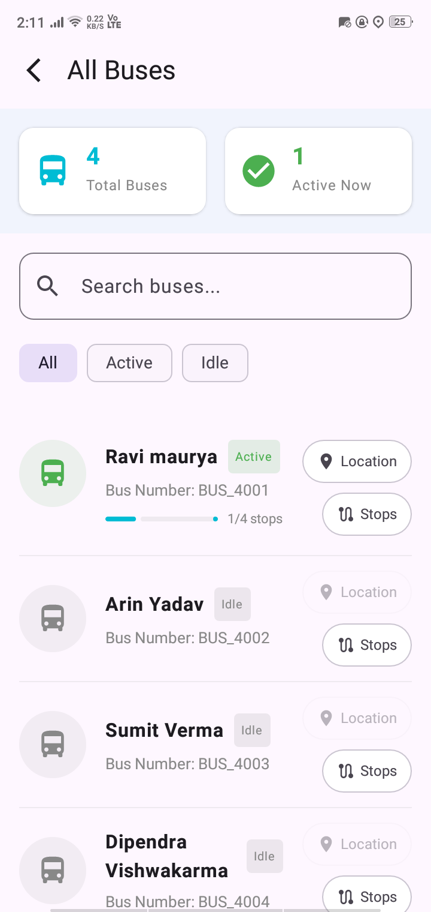
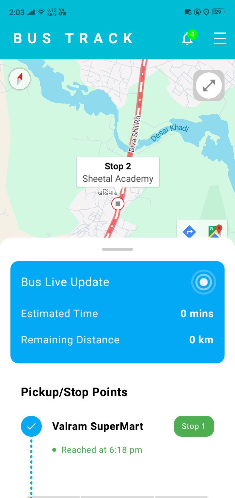
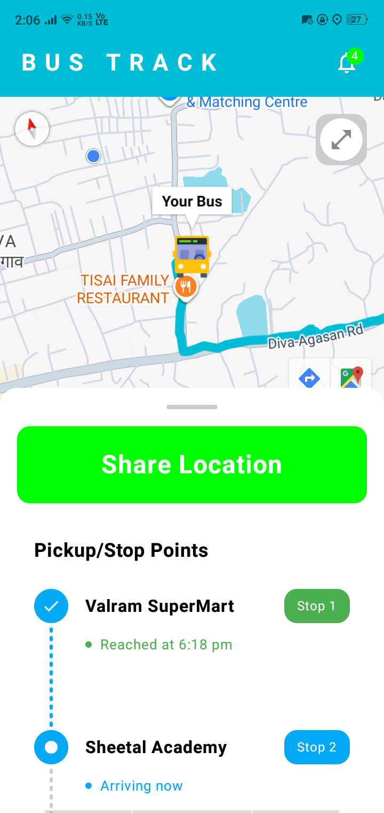

# School Bus Tracking App

## Description
The School Bus Tracking App is a versatile application designed to help parents and school authorities track the real-time location of school buses, ensuring the safety and punctuality of students' journeys.

## Screenshots
| Onboarding Screen | Portal Screen | Admin Home Screen |
|-------------|------------------|------------------|
|  |  |  |

| All Live Buses Screen | Parent Home Screen | Driver Home Screen |
|-------------|------------------|------------------|
|  |  |  |

## Features
- Four different Portals (Admin, Parent, Driver, and Caretaker)
- Real-time bus tracking
- Push Notifications for bus arrivals and delays
- Manage/Update bus, driver, parent, students from Admin Portal
- User-friendly interface for parents and school administrators

## Tech Stack
- Kotlin
- Jetpack Compose
- Android SDK
- Firebase for real-time database, push notification
- Google Maps API for tracking and location services

## License
MIT License

## Acknowledgements
- Thanks to the contributors who made this project possible.
- Special thanks to the developers of the libraries that facilitated the development of this application.
